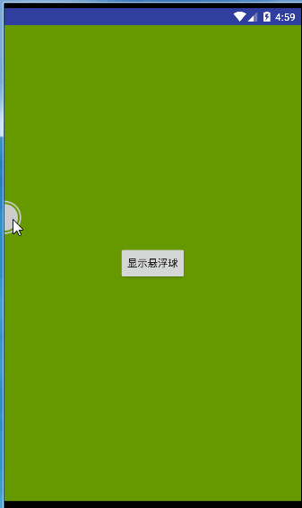
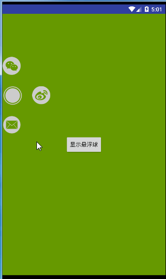

# FloatBall

### 效果图

 |


### 初始化悬浮球配置

```
 int ballSize = DensityUtil.dip2px(this, 45);
 Drawable ballIcon = BackGroudSeletor.getdrawble("ic_floatball", this);
 FloatBallCfg ballCfg = new FloatBallCfg(ballSize, ballIcon);
```
### 生成悬浮球
FloatBallManager是提供操控悬浮球的类，可以通过它来添加菜单，添加点击事件，显示和隐藏悬浮球
#### 显示菜单
##### 初始化悬浮菜单配置

```
 int menuSize = DensityUtil.dip2px(this, 180);
 int menuItemSize = DensityUtil.dip2px(this, 40);
 FloatMenuCfg menuCfg = new FloatMenuCfg(menuSize, menuItemSize);
```
##### 生成floatballManger

```
mFloatballManager = new FloatBallManager(getApplicationContext(), ballCfg, menuCfg);
```
##### 添加悬浮菜单

```
addFloatMenuItem();
private void addFloatMenuItem() {
    MenuItem personItem = new MenuItem(BackGroudSeletor.getdrawble("ic_weixin", this)) {
        @Override
        public void action() {
            toast("打开微信");
            mFloatballManager.closeMenu();
        }
    };
    MenuItem walletItem = new MenuItem(BackGroudSeletor.getdrawble("ic_weibo", this)) {
        @Override
        public void action() {
            toast("打开微博");
        }
    };
    MenuItem settingItem = new MenuItem(BackGroudSeletor.getdrawble("ic_email", this)) {
        @Override
        public void action() {
            toast("打开邮箱");
            mFloatballManager.closeMenu();
        }
    };
    mFloatballManager.addMenuItem(personItem)
            .addMenuItem(walletItem)
            .addMenuItem(settingItem)
            .buildMenu();
}
```

#### 不显示菜单
##### 生成floatballManger
```
mFloatballManager = new FloatBallManager(getApplicationContext(), ballCfg);
```
##### 设置悬浮球点击事件

```
// 如果没有添加菜单，可以设置悬浮球点击事件
if (mFloatballManager.getMenuItemSize() == 0) {
    mFloatballManager.setOnFloatBallClickListener(new FloatBallManager.OnFloatBallClickListener() {
    @Override
        public void onFloatBallClick() {
            toast("点击了悬浮球");
        }
});
}
```
### 设置悬浮球所需权限

悬浮球需要判断有没有权限和申请权限这两个功能，这里用的是别人写好的库，可以自己实现。

```
private void setFloatPermission() {
    //设置悬浮球权限，用于申请悬浮球权限的，这里用的是别人写好的库，可以自己选择
    //如果不设置permission，则不会弹出悬浮球
    mFloatPermissionManager = new FloatPermissionManager();
    mFloatballManager.setPermission(new FloatBallManager.IFloatBallPermission() {
        @Override
        public boolean onRequestFloatBallPermission() {
            requestFloatBallPermission(MainActivity.this);
            return true;
            }

        @Override
        public boolean hasFloatBallPermission(Context context) {
            return mFloatPermissionManager.checkPermission(context);
        }

        @Override
        public void requestFloatBallPermission(Activity activity) {
            mFloatPermissionManager.applyPermission(activity);
        }

    });
```
### 实现应用内悬浮球
如果想让悬浮球只在应用内打开，可以参考以下代码实现：

```
private ActivityLifeCycleListener mActivityLifeCycleListener = new ActivityLifeCycleListener();

 //注册Activity生命周期的监听回调
 getApplication().registerActivityLifecycleCallbacks(mActivityLifeCycleListener);

 //注册ActivityLifeCyclelistener以后要记得注销，以防内存泄漏。
 getApplication().unregisterActivityLifecycleCallbacks(mActivityLifeCycleListener);

 public class ActivityLifeCycleListener implements Application.ActivityLifecycleCallbacks {

        @Override
        public void onActivityCreated(Activity activity, Bundle savedInstanceState) {
        }

        @Override
        public void onActivityStarted(Activity activity) {
        }

        @Override
        public void onActivityResumed(Activity activity) {
            ++resumed;
            setFloatballVisible(true);
        }

        @Override
        public void onActivityPaused(Activity activity) {
            --resumed;
            if (!isApplicationInForeground()) {
                setFloatballVisible(false);
            }
        }

        @Override
        public void onActivityStopped(Activity activity) {
        }

        @Override
        public void onActivityDestroyed(Activity activity) {
        }

        @Override
        public void onActivitySaveInstanceState(Activity activity, Bundle outState) {
        }
    }

```
也可以在Application里实现此功能

### 悬浮球显示与隐藏

```
  //显示悬浮球
  mFloatballManager.show();
  //隐藏悬浮球
  mFloatballManager.hide();
```
### 更新日志：<br/>

    2017-11-9：
    1.解决android 7.1.1以后悬浮球显示几秒后自动隐藏的问题。

### 感谢

1. [悬浮球权限适配相关的库](https://github.com/zhaozepeng/FloatWindowPermission)


